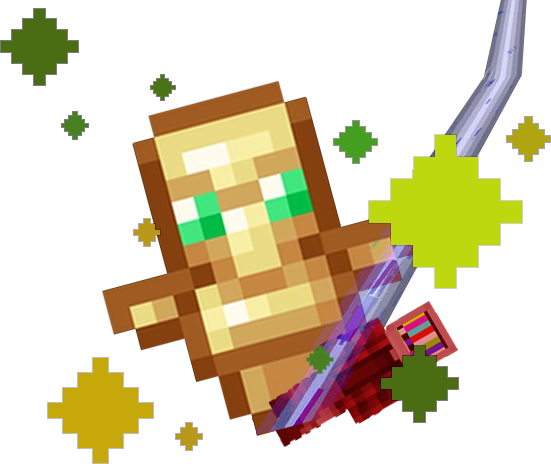
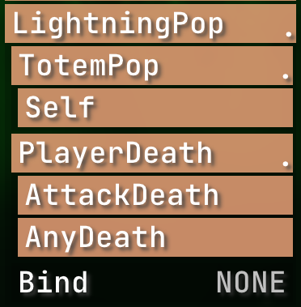

    

<h1 align="center">LightningPop</h1>

A RusherHacks Plugin that spawns lightning on totem pops and player deaths.

  
  
  

## Features:

- **TotemPop:** Enable or disable lightning effects for totem pops.
    - **Self:** Include or exclude your own totem pops in the lightning effect.
- **PlayerDeath:** Enable or disable lightning effects for player deaths.
    - **AttackDeath:** Trigger lightning on player deaths caused by attacks.
    - **AnyDeath:** Trigger lightning on any player death within visual range.

## Module Settings:

    

## How to Use:

- Enable the plugin and configure the settings according to your preferences.
- Experience lightning effects when a totem pops or when players die based on your configured settings.

## Contributing:

Contributions are welcome! Please see the [CONTRIBUTING.md](CONTRIBUTING.md) file for guidelines on how to contribute to this project.
