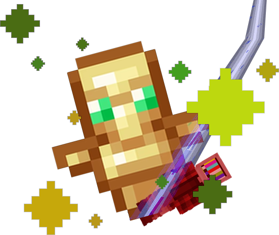
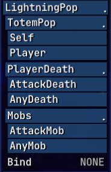

    

<h1 align="center">LightningPop</h1>

A RusherHacks Plugin that spawns lightning on totem pops, player deaths, and mob deaths.

  
  
  

---

## ⚡ Features:

- **TotemPop:** Enable or disable lightning effects for totem pops.
  - **Self:** Triggers lightning when _you_ pop a totem.
  - **Player:** Triggers lightning when _another player_ pops a totem.
- **PlayerDeath:** Enable or disable lightning effects for player deaths.

  - **AttackDeath:** Triggers lightning when _you_ kill a player.
  - **AnyDeath:** Triggers lightning when _any player_ in your render distance dies.

- **Mobs:** Enable or disable lightning effects for mob deaths.
  - **AttackMob:** Triggers lightning when _you_ kill a mob using melee, arrows, tridents, or End Crystals.
  - **AnyMob:** Triggers lightning when _any player_ in your render distance kills a mob using any method.

---

## ⚙️ Module Settings:

    

---

## 🚀 How to Use:

1. **Download and install the plugin.**
2. **Enable the plugin in RusherHacks.**
3. **Configure the settings** according to your preferences:
   - Choose whether to enable or disable lightning for totem pops, player deaths, and mob deaths.
   - Fine-tune sub-settings to control specific behaviors like "Self" for totems or "AttackMob" for mobs.
4. **Experience lightning effects** in-game based on your configured settings.

---

## 🤝 Contributing:

Contributions are welcome! Please see the [CONTRIBUTING.md](CONTRIBUTING.md) file for guidelines on how to contribute to this project.
